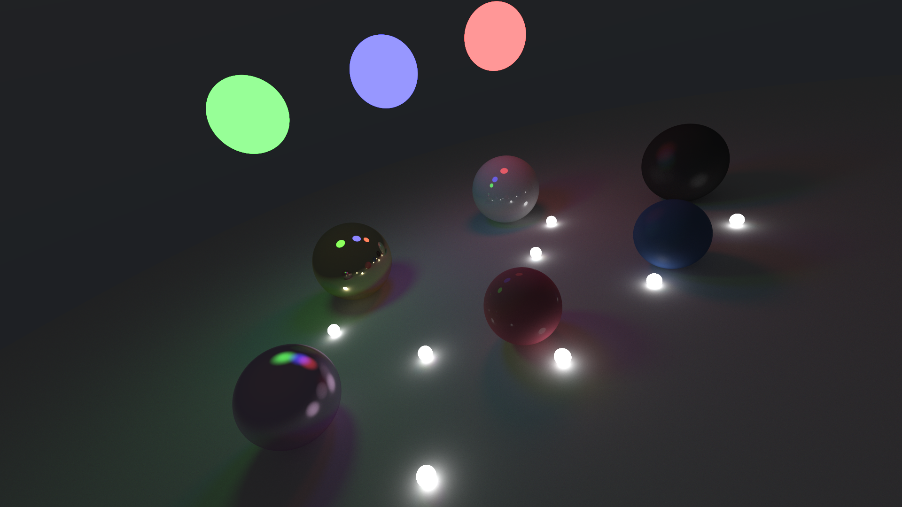

# software-path-tracer

A simple CPU-based path tracer written in C++.



It currently supports spheres that can reflect light in different ways depending on their material properties or emit light themselves.
By changing how light interacts with an object, you can model materials such as metal, rubber and plastic.

## Dependencies

* **CMake** (3.10+)
* **C++17 Compiler**
* **yaml-cpp** (Automatically fetched via CMake, so no manual action is required)

> YAML is a human-readable data serialization language. It is used in this project to define scene properties (materials, objects, camera) in a clean and easy-to-edit format.

## Building

From the project root directory:

```bash
cmake -S . -B build-release
cmake --build build-release --config Release
```

## Usage

The executable requires two arguments: the path to the scene file and a quality preset. The image is written to standard output (stdout), so you must redirect it to a `.ppm` file.

> **Note on PPM:** PPM (Portable Pixel Map) is a simple, uncompressed image format often used in graphics programming because it is easy to generate. Most image viewers (such as GIMP or IrfanView) can open PPM files, and you can easily convert them to PNG. I use ImageMagick with the command: `magick input.ppm output.png`.

### Syntax

```bash
./build-release/path_tracer <scene_file.yaml> <quality_preset> > <output_image.ppm>
```

### Quality Presets (Resolution / Samples)

* `0`: Preview (400px width, 100 samples)
* `1`: Medium (900px width, 900 samples)
* `2`: High (1080px width, 1500 samples)
* `3`: Ultra (1920px width, 15000 samples) — *Very slow*

### Example

```bash
./build-release/path_tracer demos/specular_demo.yaml 1 > output.ppm
```

## Scene Format (YAML)

Scenes are defined in `.yaml` files containing sections for `materials`, `world`, and `camera`, plus global settings.

### Materials

```yaml
materials:
  my_material:
    albedo: [0.7, 0.7, 0.2]         # RGB Color
    smoothness: 0.85                # 0.0 (rough) to 1.0 (mirror)
    specular_probability: 0.95      # Chance of specular reflection
    specular_color: [1.0, 1.0, 1.0] # Reflection tint
    emission_strength: 0.0          # Light intensity (optional)
    emission_color: [0.0, 0.0, 0.0] # Light color (optional)
```

### World / Objects

```yaml
world:
  - type: sphere
    center: [0, 0, -1]
    radius: 0.5
    material: "my_material"
```

### Global Settings and Camera

```yaml
ambient_light_strength: 0.1

camera:
  look_from: [-2.0, 3.2, 3.3]  # Camera position
  look_at: [0, 0, -2.5]        # Look target
  fov: 65                      # Field of view
```
